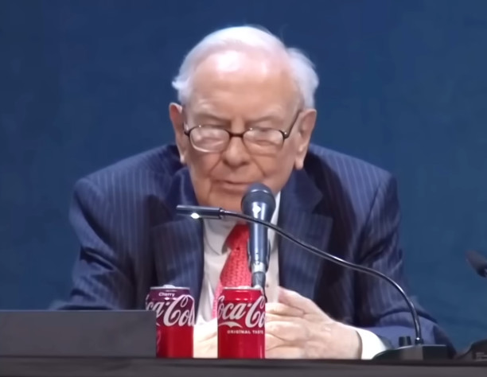

# We are all Complicit

**Is he trying to tell us something...?**

I'm not going to say anything profound in this post. I will restate something we already know, that all of the food is poison and all of the big businesses sell poison. But for whatever reason the financial reality has settled in. 

The world puts X% of its capital in US stocks. the big whatever are Y% of US stocks. All of our retirement funds, index funds, etc. go into this because we need to maximize our returns or die to inflation. Woops, it turned into a reserve banking post.

**Maybe crypto's not so bad after all...**
